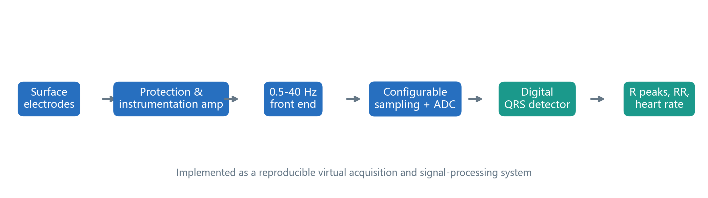
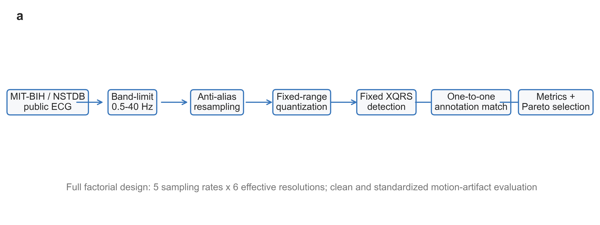
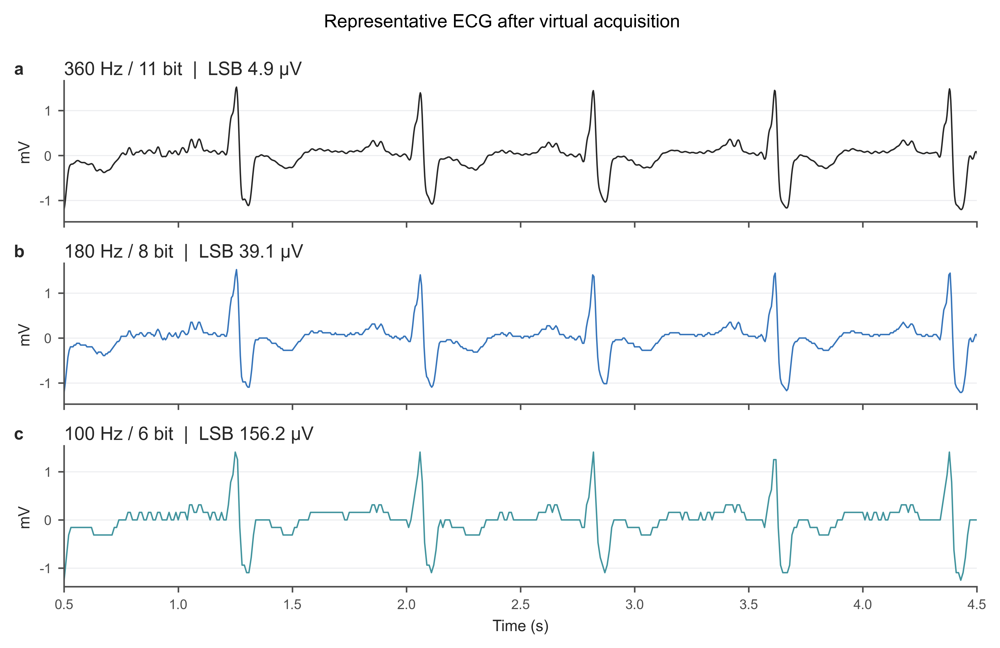
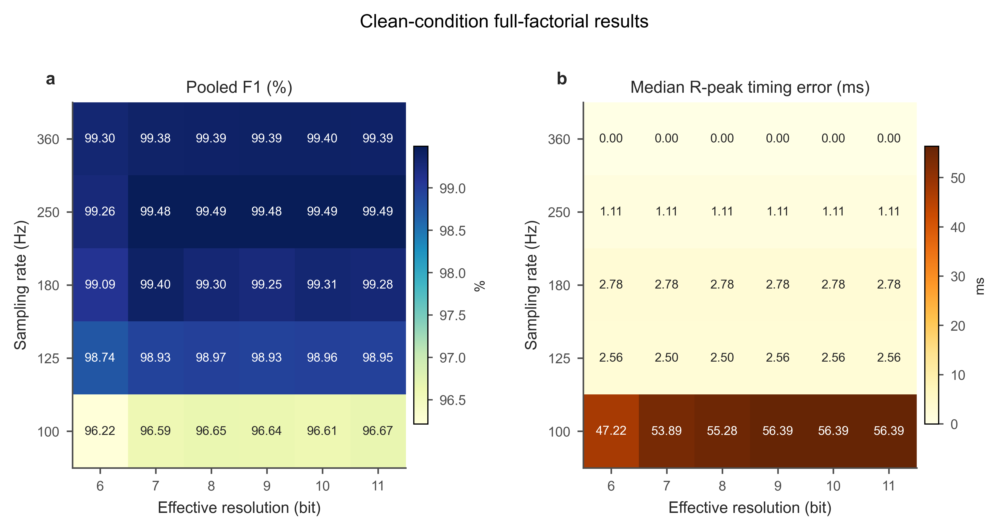
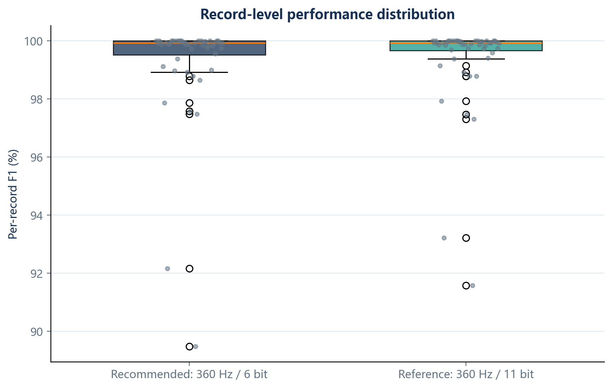
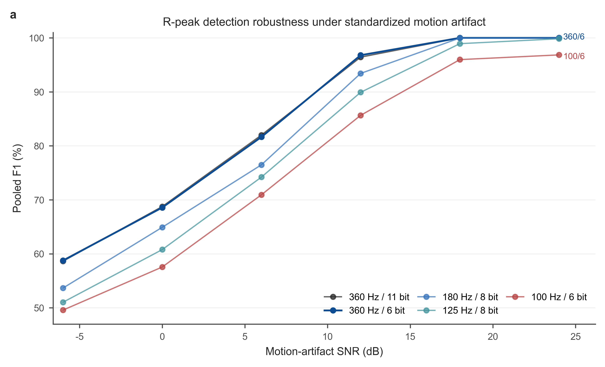
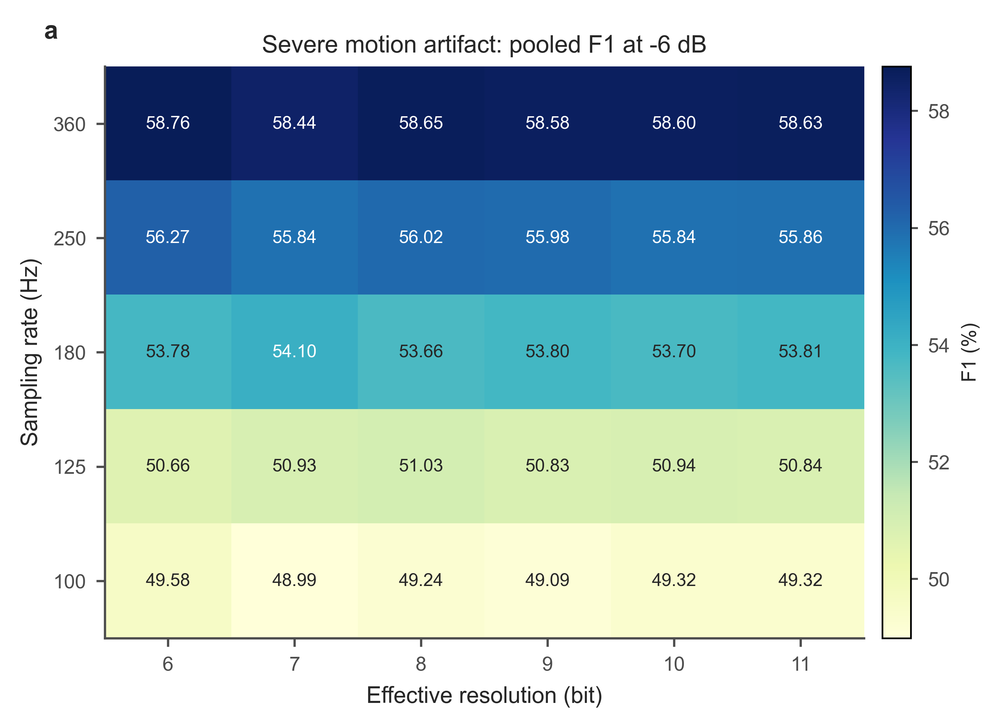
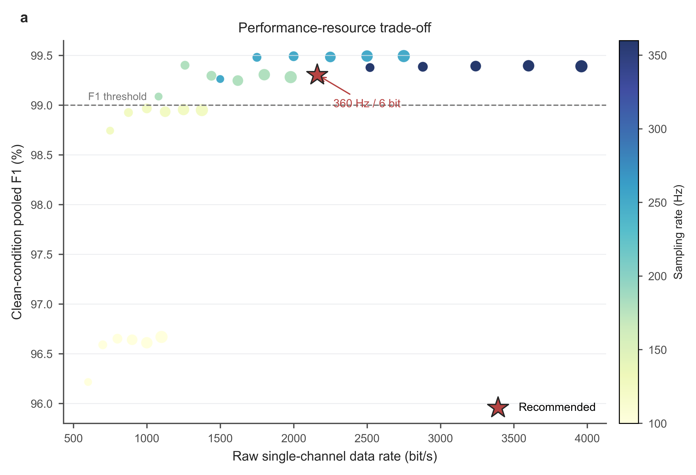

# 面向可穿戴心电监护的ECG采样率、ADC有效位数与抗噪性能联合设计

**课程：** 生物医学电子（2）  
**姓名：** 提交前填写　**学号：** 提交前填写　**班级：** 提交前填写  
**完成日期：** 2026年6月  
**项目仓库：** https://github.com/Lebron-shun/ecg-sampling-adc-noise-robustness  
**交互展示：** https://lebron-shun.github.io/ecg-sampling-adc-noise-robustness/

## 摘要

面向长时程可穿戴心电监护中的存储、传输与抗噪权衡，本项目构建了一个可复现的虚拟ECG采集系统，系统研究采样率与ADC有效位数对R峰检测的联合影响。实验使用MIT-BIH Arrhythmia Database的48条动态心电记录，以及MIT-BIH Noise Stress Test Database中12条标准电极运动伪影记录。虚拟采集链路包含0.5-40 Hz前端响应、抗混叠重采样、固定10 mV满量程量化和固定参数XQRS检测器。对5种采样率和6种有效位数组成的30种配置进行全因子评价，并使用灵敏度、阳性预测率、F1、R峰时间误差、削顶率和原始数据率进行综合比较。

结果表明，推荐配置为**360 Hz / 6 bit**。其干净条件合并F1为99.305%，参考配置360 Hz / 11 bit为99.391%，下降0.086个百分点；R峰时间误差中位数为0.00 ms。推荐配置将单通道原始数据率降至2160 bit/s，相对参考配置减少45.5%。在SNR不低于6 dB的标准运动伪影条件下，相对参考配置的最差F1下降为0.35个百分点。研究说明，在以R峰与RR间期监测为目标的条件下，可通过任务导向的采集参数联合设计显著降低数据量；但结论不能外推到ST段分析、临床诊断或真实硬件功耗。

**关键词：** 心电信号；采样率；ADC有效位数；R峰检测；运动伪影；可穿戴监护

## 1 引言与医学应用背景

动态心电监护需要长时间采集人体表面ECG，并从中提取R峰、RR间期和心率。可穿戴设备通常受到电池、存储空间和无线传输带宽限制。提高采样率和ADC位数能够保留更多细节，但也增加数据率与处理负担；过度降低配置则可能造成QRS形态失真、R峰定位误差增加，并降低噪声环境下的检测可靠性。

表1将医学应用需求、工程约束和评价指标对应起来。本项目将问题限定为R峰与RR间期监测任务，不进行疾病分类、ST段分析或临床决策。研究目标是在统一算法和固定输入量程下，定量回答采样率、ADC有效位数和运动伪影如何共同影响R峰检测，并寻找性能与数据率之间的合理折中。

表1　医学应用需求、工程约束与评价指标

| 应用需求 | 工程约束 | 本项目评价指标 |
|---|---|---|
| 长时间心率与RR间期监测 | 存储容量、无线传输带宽、电池供电 | 原始数据率、每日存储量 |
| 可穿戴运动场景 | 电极运动伪影、基线漂移、瞬态干扰 | 不同SNR下的F1与相对下降 |
| R峰可靠检出 | 采样率、ADC有效位数、检测器鲁棒性 | 灵敏度、PPV、合并F1、宏平均F1 |
| R峰定位精度 | 采样时间间隔与抗混叠滤波 | 时间误差中位数、P95时间误差 |
| 可复现工程评估 | 公开数据、固定参数、自动化脚本 | 数据清单、逐记录结果、审核报告 |

本项目交付物包括虚拟ECG采集与数字处理模块、全因子评估脚本、结果表与图像、课程报告、GitHub开源仓库以及交互展示网页。

## 2 系统设计原理与关键技术方案

### 2.1 系统位置与输入输出关系

完整可穿戴ECG监护系统可由表面电极、输入保护、仪表放大、模拟滤波、ADC采样、数字处理、显示/通信和数据存储模块组成。图1显示了该完整链路。本作业实际实现其中的虚拟采集与数字处理模块：输入为公开ECG记录及其人工标注，输出为不同采样率和ADC有效位数下的R峰检测性能、数据率、抗噪退化和推荐配置。本项目不声称制作真实硬件，但在参数设计中保留模拟前端带宽、满量程、抗混叠过渡带等工程约束。

### 2.2 核心设计指标

固定满量程为10 mV峰峰值。N位ADC的量化步长为：

`LSB = 10 mV / 2^N`

单通道无压缩数据率为：

`R = fs × N`

候选采样率为360、250、180、125和100 Hz；有效位数为11、10、9、8、7和6 bit。原始数据库为360 Hz、11 bit，因此不研究更高位数的收益。

表2　核心设计指标与约束

| 指标 | 取值 | 设计依据 |
|---|---:|---|
| 前端通带 | 0.5-40 Hz | 保留主要QRS能量，抑制基线漂移和高频噪声 |
| 满量程 | 10 mV峰峰值 | 与MIT-BIH原始量化范围一致 |
| 候选采样率 | 360/250/180/125/100 Hz | 覆盖参考配置与低数据率配置 |
| 候选ADC有效位数 | 11/10/9/8/7/6 bit | 原始数据为11 bit，不外推更高位数 |
| 检测匹配窗口 | ±150 ms，敏感性分析±75 ms | 对齐人工标注并评估定位误差 |
| 噪声SNR | 24/18/12/6/0/-6 dB | 使用NSTDB标准运动伪影压力测试 |
| 推荐约束 | F1≥99%，F1下降≤0.5 pp，噪声下降≤2 pp，时间误差≤20 ms | 与R峰/RR监测任务需求对应 |

表3　ADC量化步长与参考采样率下数据率

| ADC有效位数 | LSB (µV) | 360 Hz数据率 (bit/s) |
|---:|---:|---:|
| 11 | 4.883 | 3960 |
| 10 | 9.766 | 3600 |
| 9 | 19.531 | 3240 |
| 8 | 39.063 | 2880 |
| 7 | 78.125 | 2520 |
| 6 | 156.250 | 2160 |

对于40 Hz目标通带，100 Hz采样仅留下10 Hz的模拟抗混叠过渡带，125 Hz为22.5 Hz，180 Hz为50 Hz，250 Hz为85 Hz，360 Hz为140 Hz。因此，配置选择不仅比较数字检测性能，也要考虑模拟滤波器可实现性。

## 3 方法与实现过程

### 3.1 数据集

- MIT-BIH Arrhythmia Database：48条约30分钟双通道动态ECG，360 Hz、11 bit，并带专家心搏标注。
- MIT-BIH Noise Stress Test Database：以记录118和119构建的标准电极运动伪影压力测试记录，SNR为24、18、12、6、0和-6 dB。

### 3.2 实验流程

表4列出实现环境与主要工具。公开数据和开源算法均注明来源，本项目的主要工作是构建虚拟采集链路、参数化全因子实验、指标统计、结果可视化、报告生成与交互展示。

表4　实现环境与工具

| 类别 | 工具或数据 | 用途 |
|---|---|---|
| 编程环境 | Python | 实验脚本、统计分析、报告生成 |
| 数据读取 | WFDB Python | 下载和读取PhysioNet记录与标注 |
| 数值计算 | NumPy、SciPy | 滤波、重采样、量化与指标计算 |
| 结果处理 | Pandas | 逐记录与聚合结果表 |
| 制图 | Matplotlib | 系统图、热力图、鲁棒性曲线、帕累托图 |
| 报告 | python-docx、ReportLab | 生成DOCX和PDF |
| 展示 | HTML/CSS/JavaScript | GitHub Pages交互展示 |

每条记录选取第一通道，先通过0.5-40 Hz四阶Butterworth零相位带通模型，再使用带抗混叠滤波的多相重采样生成目标采样率。量化过程固定10 mV满量程，不对各记录单独归一化。所有配置使用固定设置的WFDB XQRS检测器。检测结果与人工标注在±150 ms内一对一匹配；另以±75 ms窗口进行定位敏感性分析。

NSTDB主分析仅评价官方交替模式中的已知噪声区间，并在区间边界去除0.2 s，避免边界滤波效应。数据处理、参数和结果表均由脚本自动生成。

表5　本人实现工作说明

| 环节 | 实现内容 | 主要输出 |
|---|---|---|
| 数据获取与校验 | 下载MIT-BIH和NSTDB，记录文件大小、SHA-256和采样率 | `data_manifest/`，`data_validation.csv` |
| 虚拟采集链路 | 前端带通、抗混叠重采样、固定满量程量化 | 不同采样率/位数组合信号 |
| R峰检测与匹配 | 固定参数XQRS，人工标注一对一匹配 | TP、FP、FN、时间误差 |
| 统计与可视化 | 聚合指标、bootstrap、配对检验、热力图和曲线 | `results/`，`figures/` |
| 工程交付 | 自动生成报告、PDF、DOCX、网页和审核结果 | `report/`，`web/`，`FINAL_AUDIT.md` |

### 3.3 性能指标

`Sensitivity = TP / (TP + FN)`  
`PPV = TP / (TP + FP)`  
`F1 = 2 × Sensitivity × PPV / (Sensitivity + PPV)`

同时计算R峰时间误差、量化均方根误差、量化信噪比、削顶率、数据率与每天存储量。统计分析以记录为单位，使用bootstrap置信区间和配对Wilcoxon检验。

## 4 结果展示与性能评价

### 4.1 干净条件全因子结果

图4显示，推荐配置360 Hz / 6 bit在干净条件下获得99.305%的合并F1，较参考配置下降0.086个百分点；时间误差中位数为0.00 ms。结果显示，降低采样率对R峰定位时间精度的影响通常早于对检出率的影响。

表6　代表性配置性能对比

| 配置 | F1 (%) | 相对下降 (pp) | 时间误差 (ms) | 数据率 (bit/s) |
|---|---:|---:|---:|---:|
| 360 Hz / 11 bit | 99.391 | 0.000 | 0.00 | 3960 |
| 360 Hz / 6 bit | 99.305 | 0.086 | 0.00 | 2160 |
| 250 Hz / 8 bit | 99.491 | -0.101 | 1.11 | 2000 |
| 180 Hz / 8 bit | 99.295 | 0.095 | 2.78 | 1440 |
| 125 Hz / 8 bit | 98.967 | 0.424 | 2.50 | 1000 |
| 100 Hz / 6 bit | 96.216 | 3.175 | 47.22 | 600 |

以记录为重采样单位的bootstrap显示，推荐配置相对参考配置的宏平均F1下降95%置信区间为0.010至0.206个百分点；配对Wilcoxon检验经Holm校正后的p值为1.000。在20个探索性交互对比中，有2个bootstrap区间未跨越零，且效应量很小，未显示强烈的采样率-位数交互。

### 4.2 标准运动伪影抗噪性能

表7　标准运动伪影条件下推荐配置与参考配置对比

| SNR (dB) | 参考F1 (%) | 推荐配置F1 (%) | 相对下降 (pp) |
|---:|---:|---:|---:|
| 24 | 100.00 | 100.00 | 0.00 |
| 18 | 100.00 | 100.00 | 0.00 |
| 12 | 96.43 | 96.79 | -0.36 |
| 6 | 82.00 | 81.64 | 0.35 |
| 0 | 68.75 | 68.57 | 0.18 |
| -6 | 58.63 | 58.76 | -0.13 |

图6和表7显示，噪声增强后所有配置的绝对性能均下降。推荐配置在SNR不低于6 dB时相对参考配置的最差下降为0.35个百分点。严重噪声下最低F1为58.76%，说明降低数据率不能解决检测算法本身对强运动伪影的脆弱性，主要限制逐渐转向检测器鲁棒性和输入污染。

### 4.3 性能与资源权衡

图8显示，推荐配置的数据率为2160 bit/s，每天原始存储约22.25 MiB，相对360 Hz / 11 bit参考配置减少45.5%。在满足预设干净条件性能、相对抗噪退化与时间误差约束后，该配置具有较低数据率，并保留比100 Hz更合理的模拟抗混叠过渡带。

表8　设计指标达成情况

| 评价项 | 预设约束 | 推荐配置结果 | 结论 |
|---|---:|---:|---|
| 干净条件合并F1 | >= 99.0% | 99.305% | 达到 |
| 相对参考配置F1下降 | <= 0.5 pp | 0.086 pp | 达到 |
| SNR>=6 dB最坏相对下降 | <= 2.0 pp | 0.35 pp | 达到 |
| R峰时间误差中位数 | <= 20 ms | 0.00 ms | 达到 |
| 模拟抗混叠过渡带 | 优先选择可实现配置 | 140.0 Hz | 达到 |

## 5 讨论与改进分析

### 5.1 主要发现

第一，采样率和位数不应只根据波形视觉效果选择，而应根据具体任务进行联合优化。第二，R峰检出率在干净条件下可能接近性能上限，但时间误差仍能揭示低采样率的代价。第三，强运动伪影下的主要限制逐渐转向检测器鲁棒性与输入污染，而不是ADC位数本身。

### 5.2 工程意义

360 Hz / 6 bit适合以心率和RR间期为主的长时监测。数据率降低意味着存储与无线传输负担下降，也可能减少ADC和处理系统的工作量。但本项目没有真实硬件，不能将数据率下降直接写成实测功耗下降。

### 5.3 局限性

**医学应用限制。** 结论仅适用于R峰与RR间期监测，不能外推到ST段分析、形态诊断、心律失常分类或临床决策。真实应用还需要安全性、可靠性、伦理和临床验证。

**工程实现限制。** 原始数据已经以360 Hz、11 bit数字化，只能可信研究降采样和降低有效位数；零相位离线滤波不等价于实时因果模拟前端，尚未验证群时延、元件误差、输入保护和真实功耗。

**算法限制。** XQRS参数保持固定，结果包含特定检测器与采集配置之间的交互；严重运动伪影下需要更鲁棒的检测器或信号质量控制。

**数据限制。** NSTDB是标准化噪声压力测试，不能完全代表长期真实佩戴中的所有干扰，也没有覆盖不同设备结构、皮肤接触状态和人群差异。

### 5.4 后续改进

后续应搭建真实模拟前端与ADC硬件，测量输入保护、共模抑制、实时延迟和实际功耗；加入信号质量指数，在低质量片段拒绝输出；比较因果滤波与不同QRS检测算法；并使用真实可穿戴运动数据进行外部验证。同时可以将交互展示网页扩展为参数设计教学工具，用于展示采样率、量化位数和抗噪性能之间的权衡。

## 6 结论

本项目完成了ECG采样率、ADC有效位数与抗噪性能的全因子联合设计。基于48条动态ECG和12条标准运动伪影记录，推荐360 Hz / 6 bit作为R峰监测任务的工程折中方案。该配置在保持与参考配置接近的R峰检测性能时，将原始数据率降低45.5%。研究结果支持任务导向的低数据率采集设计，同时强调在严重运动伪影、真实因果前端和临床用途方面仍需进一步验证。

## 参考文献

[1] Moody GB, Mark RG. The impact of the MIT-BIH Arrhythmia Database. IEEE Engineering in Medicine and Biology Magazine, 2001, 20(3):45-50.  
[2] Goldberger AL, et al. PhysioBank, PhysioToolkit, and PhysioNet. Circulation, 2000, 101(23):e215-e220.  
[3] MIT-BIH Arrhythmia Database. PhysioNet. https://physionet.org/content/mitdb/1.0.0/  
[4] MIT-BIH Noise Stress Test Database. PhysioNet. https://physionet.org/content/nstdb/1.0.0/  
[5] WFDB Python Package Documentation. https://wfdb.readthedocs.io/
[6] Pan J, Tompkins WJ. A real-time QRS detection algorithm. IEEE Transactions on Biomedical Engineering, 1985, BME-32(3):230-236.

## 附录A：核心参数表

| 参数 | 取值 |
|---|---|
| 源采样率 | 360 Hz |
| 目标采样率 | 360、250、180、125、100 Hz |
| ADC有效位数 | 11、10、9、8、7、6 bit |
| 满量程 | 10 mV峰峰值 |
| 前端通带 | 0.5-40 Hz |
| 匹配窗口 | 150 ms，敏感性分析75 ms |
| 噪声区间边界余量 | 0.2 s |
| bootstrap次数 | 1000 |

## 附录B：关键脚本说明

| 脚本 | 作用 |
|---|---|
| `src/download_data.py` | 下载MIT-BIH与NSTDB数据 |
| `src/validate_data.py` | 校验数据完整性、采样率和标注 |
| `src/run_experiments.py` | 运行全因子虚拟采集与R峰检测 |
| `src/analyze_results.py` | 聚合结果、统计检验、推荐配置、制图 |
| `src/build_report.py` | 生成Markdown和DOCX报告 |
| `src/build_pdf.py` | 生成最终PDF报告 |
| `src/audit_project.py` | 审核交付物完整性和课程要求覆盖 |

## 附录C：结果文件索引

| 路径 | 内容 |
|---|---|
| `results/per_record_clean.csv` | MIT-BIH逐记录干净条件结果 |
| `results/per_record_noise.csv` | NSTDB逐记录噪声条件结果 |
| `results/candidate_summary.csv` | 30组配置汇总与约束判断 |
| `figures/figure_*.png` | 系统图、流程图、波形图、热力图、鲁棒性曲线和帕累托图 |
| `report/final_report.pdf` | 最终课程报告PDF |
| `report/final_report.docx` | 可编辑课程报告DOCX |
| `web/index.html` | 交互展示网页 |

## 附录D：复现与展示链接

项目提供完整源代码、固定参数配置、软件依赖、数据下载脚本、SHA-256数据清单、逐记录结果、聚合结果与自动制图脚本。执行顺序：

1. `python src/download_data.py`
2. `python src/validate_data.py`
3. `python src/run_experiments.py --mode all --workers 8`
4. `python src/analyze_results.py`
5. `python src/build_report.py`
6. `python src/build_pdf.py`
7. `python src/audit_project.py`

GitHub仓库：https://github.com/Lebron-shun/ecg-sampling-adc-noise-robustness  
交互展示页：https://lebron-shun.github.io/ecg-sampling-adc-noise-robustness/
